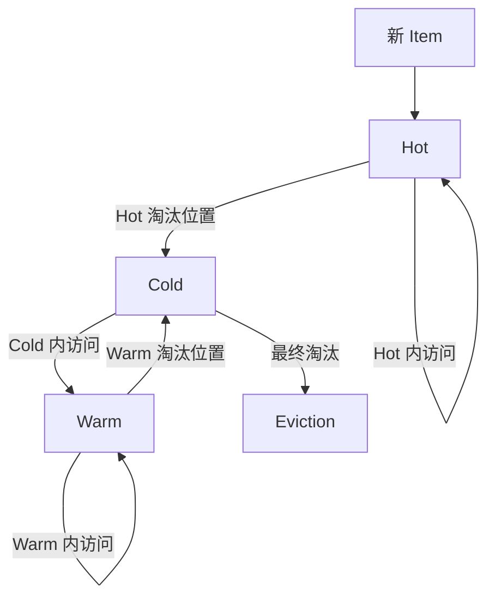

# LRU-2Q

```mermaid
flowchart TD
    A["新 Item"] --> B["Hot"]
    B -->|"Hot 内访问"| B
    B -->|"Hot 淘汰位置"| C["Cold"]
    C -->|"Cold 内访问"| D["Warm"]
    D -->|"Warm 内访问"| D
    D -->|"Warm 淘汰位置"| C
    C -->|"最终淘汰"| E["Eviction"]
```